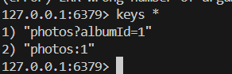
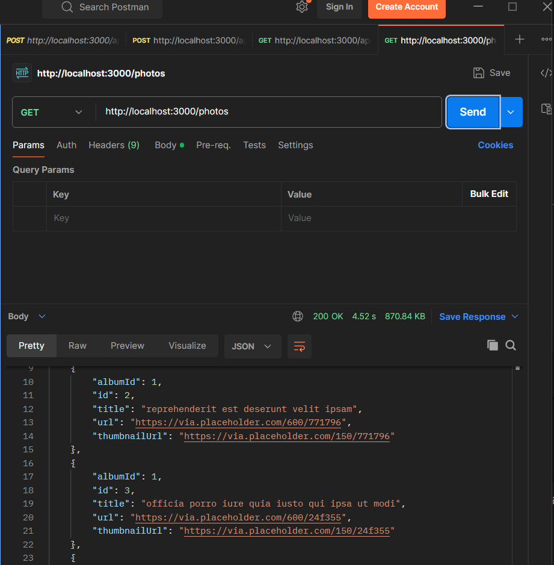
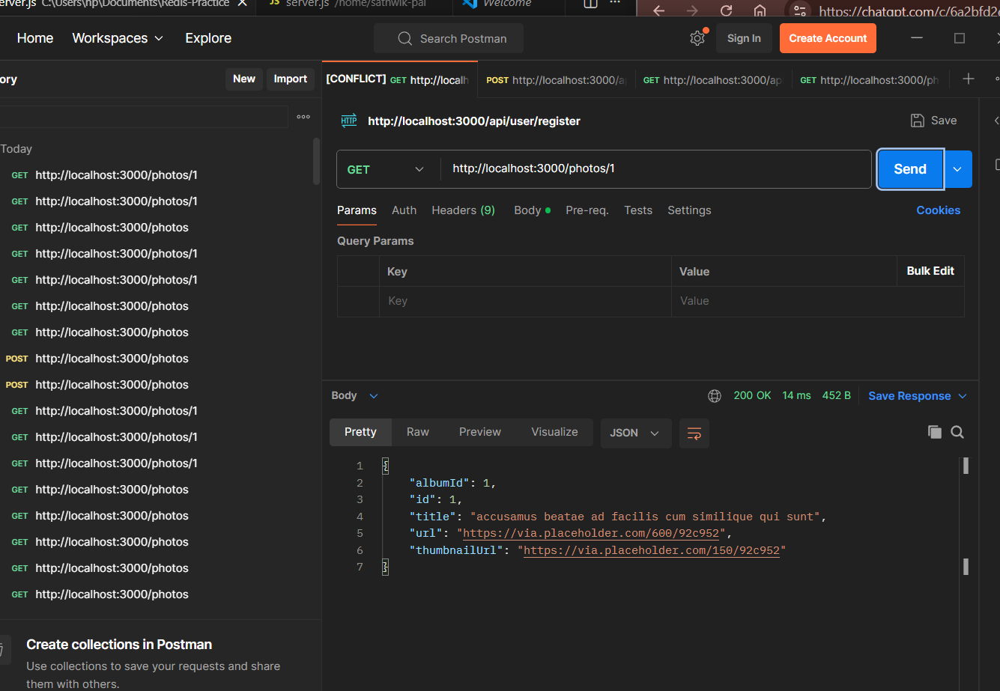
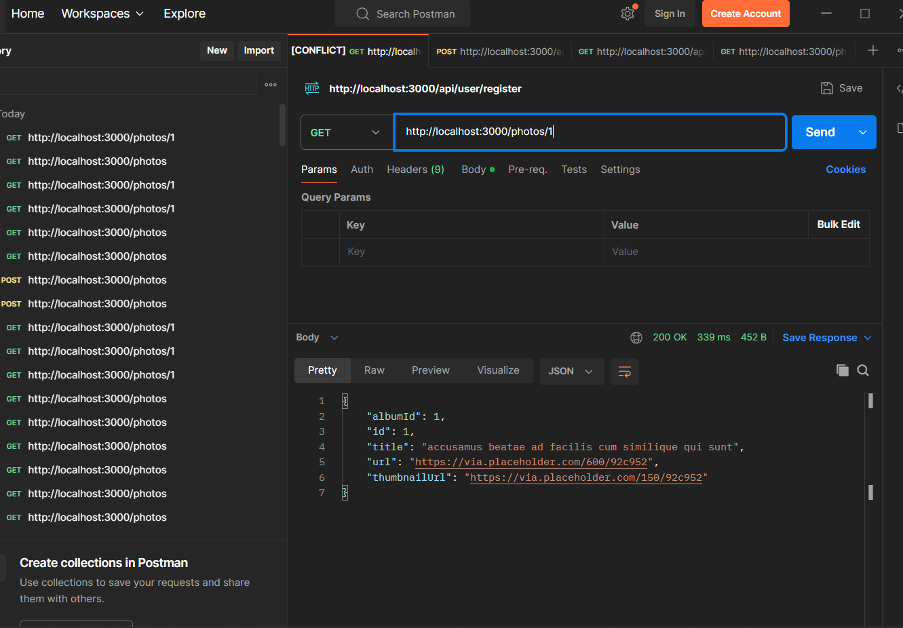
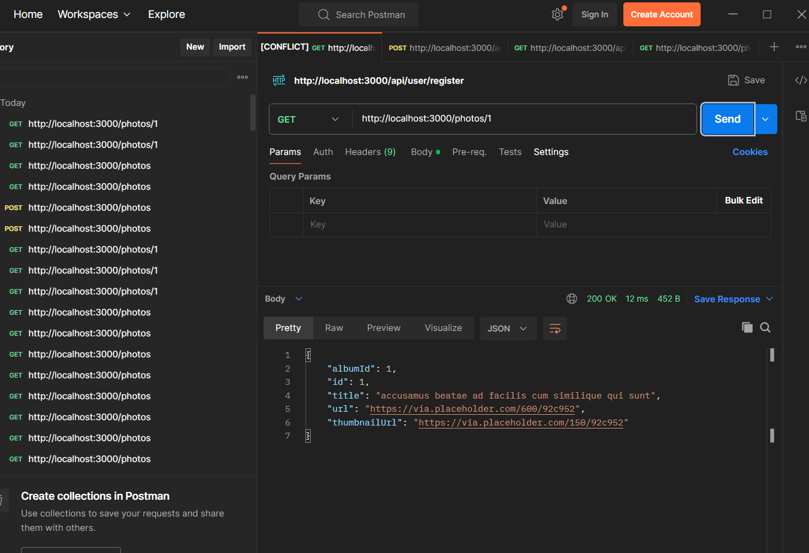

# Redis Caching Demo with Node.js, Express & Redis

A simple demonstration of how Redis caching improves API response times in a Node.js Express application.

This project fetches photo data from the JSONPlaceholder API and stores responses in Redis to reduce repeated API calls and improve performance.

---

## 🚀 Features

* Redis Cache Integration
* Cache Hit / Cache Miss Detection
* Caching of:

  * Complete Photo Albums
  * Individual Photos
* Automatic Cache Expiration (TTL)
* Generic Cache Helper Function
* Express.js Backend
* JSONPlaceholder API Integration

---

## 🛠️ Tech Stack

* Node.js
* Express.js
* Redis
* Axios
* CORS

---

## 📂 Project Structure

```text
project/
│
├── server.js
├── package.json
├── README.md
└── images/
    ├── redis-cli.png
    ├── album-cache-miss.png
    ├── album-cache-hit.png
    ├── photo-cache-miss.png
    └── photo-cache-hit.png
```

---

## ⚙️ Installation

### 1. Clone Repository

```bash
git clone https://github.com/yourusername/redis-caching-demo.git

cd redis-caching-demo
```

### 2. Install Dependencies

```bash
npm install
```

### 3. Start Redis Server

Make sure Redis is running locally.

Linux/Mac:

```bash
redis-server
```

Windows (WSL):

```bash
redis-server
```

### 4. Start Application

```bash
node server.js
```

Output:

```bash
Redis Connected
Server running on port 3000
```

---

# 📌 API Endpoints

## Get Photos by Album

```http
GET /photos
```

Header:

```http
albumId: 1
```

Example:

```http
GET http://localhost:3000/photos
```

Headers:

```text
albumId = 1
```

---

## Get Single Photo

```http
GET /photos/:id
```

Example:

```http
GET http://localhost:3000/photos/1
```

---

# 🧠 Redis Caching Workflow

## First Request (Cache Miss)

1. User sends request.
2. Redis checks for key.
3. Key not found.
4. Data fetched from API.
5. Data stored in Redis.
6. Response returned.

```text
Client
  ↓
Redis Lookup
  ↓
Cache Miss
  ↓
JSONPlaceholder API
  ↓
Store in Redis
  ↓
Return Response
```

---

## Subsequent Requests (Cache Hit)

1. User sends same request.
2. Redis finds key.
3. Cached data returned instantly.
4. No API call required.

```text
Client
  ↓
Redis Lookup
  ↓
Cache Hit
  ↓
Return Cached Data
```

---

# ⏳ Cache Expiration

TTL is configured as:

```javascript
const DEFAULT_EXPIRATION = 3600
```

Meaning:

```text
3600 seconds = 1 hour
```

After 1 hour Redis automatically removes the cached data.

---

# 📸 Screenshots

## 1. Redis CLI Showing Stored Keys



Redis successfully storing cached responses.

---

## 2. Album Request - Cache Miss



The first request triggers:

* Redis Lookup
* Cache Miss
* External API Call
* Save to Redis

Console Output:

```text
Checking Redis: photos?albumId=1
Cache Miss
Saving to Redis
```

---

## 3. Album Request - Cache Hit



The same request now loads directly from Redis.

Console Output:

```text
Checking Redis: photos?albumId=1
```

No API call occurs.

---

## 4. Single Photo Request - Cache Miss



First request for a specific photo.

Console Output:

```text
Checking Redis: photos:1
Cache Miss
Saving to Redis
```

---

## 5. Single Photo Request - Cache Hit



Redis returns cached photo instantly.

Console Output:

```text
Checking Redis: photos:1
```

---

# 🔑 Redis Keys Used

Album Cache:

```text
photos?albumId=1
photos?albumId=2
photos?albumId=3
```

Single Photo Cache:

```text
photos:1
photos:2
photos:3
```

This ensures:

* Different albums are cached separately.
* Different photos are cached separately.
* No unnecessary data retrieval.

---

# 🧩 Generic Cache Helper Function

```javascript
async function getOrSetCache(key, cb) {
    const data = await redisClient.get(key);

    if (data != null) {
        return JSON.parse(data);
    }

    const freshData = await cb();

    await redisClient.setEx(
        key,
        DEFAULT_EXPIRATION,
        JSON.stringify(freshData)
    );

    return freshData;
}
```

Benefits:

* Reusable
* Cleaner code
* Works for any endpoint
* Centralized caching logic

---

# 📈 Performance Improvement

Without Redis:

```text
Request
 ↓
API Call
 ↓
Response
```

With Redis:

```text
Request
 ↓
Redis Cache
 ↓
Response
```

Advantages:

* Lower latency
* Reduced API traffic
* Faster response times
* Better scalability

---

# 🎯 Learning Objectives

This project demonstrates:

* Redis Fundamentals
* Cache Hit vs Cache Miss
* Key Design Strategy
* TTL Management
* Node.js + Redis Integration
* API Performance Optimization

---

# Future Improvements

* Redis Cloud Deployment
* Cache Invalidation Strategies
* Rate Limiting using Redis
* Session Storage
* Distributed Caching
* Docker Support

---

# Author

**Sathwik Pai**

Built as a learning project to understand Redis caching and backend performance optimization using Node.js and Express.
